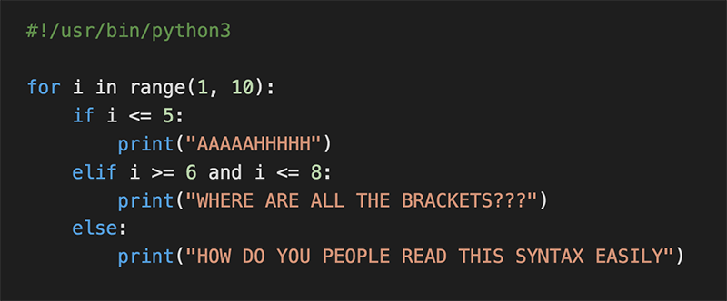

# 0x01. Python - if/else, loops, functions

:teacher: By: Guillaume

:gear: Weight: 1

:calendar: Project over - took place from Jan 2, 2024 6:00 AM to Jan 3, 2024 6:00 AM

:ballot_box_with_check: An auto review will be launched at the deadline



### In a nutshell…
- Auto QA review: 0.0/160 mandatory & 0.0/41 optional
- Altogether:  0.0%
  - Mandatory: 0.0%
  - Optional: 0.0%
  - Calculation:  0.0% + (0.0% * 0.0%)  == 0.0%

# Learning Resources
### Read or watch:
1. [More Control Flow Tools](https://intranet.alxswe.com/rltoken/jpjs5EnZTpBLLEremJYjPQ) (Read until “4.6. Defining Functions” included)
1. [IndentationError](https://intranet.alxswe.com/rltoken/F9n2AE-fpEPzt2PfBMGYAQ)
1. [How To Use String Formatters in Python 3](https://intranet.alxswe.com/rltoken/ZdtRIAkFu8dMBT99DcFBNg)
1. [Learn to Program](https://intranet.alxswe.com/rltoken/ElQgZYNHrLI7kV_ysEB1hQ)
1. [Learn to Program 2 : Looping](https://intranet.alxswe.com/rltoken/ElQgZYNHrLI7kV_ysEB1hQ)
1. [Pycodestyle – Style Guide for Python Code](https://intranet.alxswe.com/rltoken/TuTTnEg_Rwn8U1g3PEsZmA)

### man or help:
- `python3`

# Learning Objectives
> At the end of this project, you are expected to be able to [explain to anyone](https://intranet.alxswe.com/rltoken/SdBJUMTPS5VW3cQNkhaeSg), without the help of Google:

## General
- Why Python programming is awesome
- Why indentation is so important in Python
- How to use the `if`, `if ... else` statements
- How to use comments
- How to affect values to variables
- How to use the `while` and `for` loops
- How is Python’s `for` different from `C`‘s?
- How to use the `break` and `continues` statements
- How to use `else` clauses on loops
- What does the `pass` statement do, and when to use it
- How to use `range`
- What is a function and how do you use functions
- What does return a function that does not use any `return` statement
- Scope of variables
- What’s a traceback
- What are the arithmetic operators and how to use them

### Copyright - Plagiarism
- You are tasked to come up with solutions for the tasks below yourself to meet with the above learning objectives.
- You will not be able to meet the objectives of this or any following project by copying and pasting someone else’s work.
- You are not allowed to publish any content of this project.
- Any form of plagiarism is strictly forbidden and will result in removal from the program.

# Requirements
## Python Scripts
- Allowed editors: `vi`, `vim`, `emacs`
- All your files will be interpreted/compiled on Ubuntu 20.04 LTS using python3 (version 3.8.5)
- All your files should end with a new line
- The first line of all your files should be exactly `#!/usr/bin/python3`
- A `README.md` file, at the root of the folder of the project, is mandatory
- Your code should use the pycodestyle (version `2.8.*`)
- All your files must be executable
- The length of your files will be tested using `wc`

## C Scripts
- Allowed editors: `vi`, `vim`, `emacs`
- All your files will be compiled on Ubuntu 20.04 LTS using `gcc`, using the options `-Wall -Werror -Wextra -pedantic -std=gnu89`
- All your files should end with a new line
- Your code should use the Betty style. It will be checked using betty-style.pl and betty-doc.pl
- You are not allowed to use global variables
- No more than 5 functions per file
- In the following examples, the main.c files are shown as examples. You can use them to test your functions, but you don’t have to push them to your repo (if you do we won’t take them into account). We will use our own main.c files at compilation. Our main.c files might be different from the one shown in the examples
- The prototypes of all your functions should be included in your header file called lists.h
- Don’t forget to push your header file
- All your header files should be include guarded

# More Info
> Note: you do not need to understand lists yet.

<hr>

# Tasks

### `0.` Positive anything is better than negative nothing 
> This program will assign a random signed `number` to the variable number each time it is executed. Complete the source code in order to print whether the number stored in the variable `number` is positive or negative.

- You can find the source code [here](https://intranet.alxswe.com/rltoken/e4tR3cjFHqhelf4y485-zQ)
- The variable `number` will store a different value every time you will run this program
- You don’t have to understand what `import`, `random.randint` do. Please do not touch this code
- The output of the program should be:
  - The number, followed by
    - if the number is greater than 0: `is positive`
    - if the number is 0: `is zero`
    - if the number is less than 0: `is negative`
  - followed by a new line
```
[green@xero 0x01-python-if_else_loops_functions]$ ./0-positive_or_negative.py 
-5 is negative
[green@xero 0x01-python-if_else_loops_functions]$ ./0-positive_or_negative.py 
0 is zero
[green@xero 0x01-python-if_else_loops_functions]$ ./0-positive_or_negative.py 
-1 is negative
[green@xero 0x01-python-if_else_loops_functions]$ ./0-positive_or_negative.py 
-3 is negative
[green@xero 0x01-python-if_else_loops_functions]$ ./0-positive_or_negative.py 
-7 is negative
[green@xero 0x01-python-if_else_loops_functions]$ ./0-positive_or_negative.py 
3 is positive
[green@xero 0x01-python-if_else_loops_functions]$ ./0-positive_or_negative.py 
1 is positive
[green@xero 0x01-python-if_else_loops_functions]$ ./0-positive_or_negative.py 
-2 is negative
[green@xero 0x01-python-if_else_loops_functions]$ ./0-positive_or_negative.py 
3 is positive

```
- Solution File: [0-positive_or_negative.py](./0-positive_or_negative.py)

<hr>

### `1.` The last digit
> This program will assign a random signed number to the variable `number` each time it is executed. Complete the source code in order to print the last digit of the number stored in the variable `number`.
- You can find the source code [here](https://intranet.alxswe.com/rltoken/Vku0ZPFeDPuXUKD8nZ4mOQ)
- The variable `number` will store a different value every time you will run this program
- You don’t have to understand what `import`, `random.randint` do. **Please do not touch this code**. This line should not change: `number = random.randint(-10000, 10000)`
- The output of the program should be:
  - The string `Last digit of`, followed by
  - the number, followed by
  - the string `is`, followed by the last digit of `number`, followed by
    - if the last digit is greater than 5: the string `and is greater than 5`
    - if the last digit is 0: the string `and is 0`
    - if the last digit is less than 6 and not 0: the string `and is less than 6 and not 0`
  - followed by a new line
```
[green@xero 0x01-python-if_else_loops_functions]$ ./1-last_digit.py 
Last digit of 2868 is 8 and is greater than 5
[green@xero 0x01-python-if_else_loops_functions]$ ./1-last_digit.py 
Last digit of -7412 is -2 and is less than 6 and not 0
[green@xero 0x01-python-if_else_loops_functions]$ ./1-last_digit.py 
Last digit of 6524 is 4 and is less than 6 and not 0
[green@xero 0x01-python-if_else_loops_functions]$ ./1-last_digit.py 
Last digit of 6822 is 2 and is less than 6 and not 0
[green@xero 0x01-python-if_else_loops_functions]$ ./1-last_digit.py 
Last digit of 4230 is 0 and is 0
[green@xero 0x01-python-if_else_loops_functions]$ ./1-last_digit.py 
Last digit of 1916 is 6 and is greater than 5
[green@xero 0x01-python-if_else_loops_functions]$ ./1-last_digit.py 
Last digit of -7951 is -1 and is less than 6 and not 0
[green@xero 0x01-python-if_else_loops_functions]$ ./1-last_digit.py 
Last digit of 3077 is 7 and is greater than 5
[green@xero 0x01-python-if_else_loops_functions]$ ./1-last_digit.py 
Last digit of -8720 is 0 and is 0
[green@xero 0x01-python-if_else_loops_functions]$ ./1-last_digit.py 
Last digit of -6059 is -9 and is less than 6 and not 0
[green@xero 0x01-python-if_else_loops_functions]$ ./1-last_digit.py 
Last digit of -6237 is -7 and is less than 6 and not 0
```
- Solution File: [1-last_digit.py](./1-last_digit.py)

<hr>

### `2.` I sometimes suffer from insomnia. And when I can't fall asleep, I play what I call the alphabet game
> Write a program that prints the ASCII alphabet, in lowercase, not followed by a new line.
- You can only use one `print` function with string format
- You can only use one loop in your code
- You are not allowed to store characters in a variable
- You are not allowed to import any module
```
[green@xero 0x01-python-if_else_loops_functions]$ ./2-print_alphabet.py
abcdefghijklmnopqrstuvwxyz[green@xero 0x01-python-if_else_loops_functions]$ 
```
- Solution File: [2-print_alphabet.py](./2-print_alphabet.py)

<hr>

### `3.` When I was having that alphabet soup, I never thought that it would pay off
> Write a program that prints the ASCII alphabet, in lowercase, not followed by a new line.
- Print all the letters except `q` and `e`
- You can only use one `print` function with string format
- You can only use one loop in your code
- You are not allowed to store characters in a variable
- You are not allowed to import any module
```
[green@xero 0x01-python-if_else_loops_functions]$ ./3-print_alphabt.py 
abcdfghijklmnoprstuvwxyz[green@xero 0x01-python-if_else_loops_functions]$
```
- Solution File: [3-print_alphabt.py](./3-print_alphabt.py)

<hr>

### `4.` Hexadecimal printing
> Write a program that prints all numbers from `0` to `98` in decimal and in hexadecimal (as in the following example)
- You can only use one `print` function with string format
- You can only use one loop in your code
- You are not allowed to store numbers or strings in a variable
- You are not allowed to import any module
```
[green@xero 0x01-python-if_else_loops_functions]$ ./4-print_hexa.py 
0 = 0x0
1 = 0x1
2 = 0x2
3 = 0x3
4 = 0x4
5 = 0x5
6 = 0x6
7 = 0x7
8 = 0x8
9 = 0x9
10 = 0xa
11 = 0xb
12 = 0xc
13 = 0xd
14 = 0xe
15 = 0xf
16 = 0x10
17 = 0x11
18 = 0x12
...
96 = 0x60
97 = 0x61
98 = 0x62
[green@xero 0x01-python-if_else_loops_functions]$ 
```
- Solution File: [4-print_hexa.py](./4-print_hexa.py)

<hr>

### `5.` 00...99
> Write a program that prints numbers from `0` to `99`.
- Numbers must be separated by ,, followed by a space
- Numbers should be printed in ascending order, with two digits
- The last number should be followed by a new line
- You can only use no more than 2 `print` functions with string format
- You can only use one loop in your code
- You are not allowed to store numbers or strings in a variable
- You are not allowed to import any module
```
[green@xero 0x01-python-if_else_loops_functions]$ ./5-print_comb2.py 
00, 01, 02, 03, 04, 05, 06, 07, 08, 09, 10, 11, 12, 13, 14, 15, 16, 17, 18, 19, 20, 21, 22, 23, 24, 25, 26, 27, 28, 29, 30, 31, 32, 33, 34, 35, 36, 37, 38, 39, 40, 41, 42, 43, 44, 45, 46, 47, 48, 49, 50, 51, 52, 53, 54, 55, 56, 57, 58, 59, 60, 61, 62, 63, 64, 65, 66, 67, 68, 69, 70, 71, 72, 73, 74, 75, 76, 77, 78, 79, 80, 81, 82, 83, 84, 85, 86, 87, 88, 89, 90, 91, 92, 93, 94, 95, 96, 97, 98, 99
[green@xero 0x01-python-if_else_loops_functions]$ 
```
- Solution File: [5-print_comb2.py](./5-print_comb2.py)

<hr>

### `6` Inventing is a combination of brains and materials. The more brains you use, the less material you need
> Write a program that prints all possible different combinations of two digits.
- Numbers must be separated by `,`, followed by a space
- The two digits must be different
- `01` and `10` are considered the same combination of the two digits `0` and `1`
- Print only the smallest combination of two digits
- Numbers should be printed in ascending order, with two digits
- The last number should be followed by a new line
- You can only use no more than 3 `print` functions with string format
- You can only use no more than 2 loops in your code
- You are not allowed to store numbers or strings in a variable
- You are not allowed to import any module
```
[green@xero 0x01-python-if_else_loops_functions]$ ./6-print_comb3.py 
01, 02, 03, 04, 05, 06, 07, 08, 09, 12, 13, 14, 15, 16, 17, 18, 19, 23, 24, 25, 26, 27, 28, 29, 34, 35, 36, 37, 38, 39, 45, 46, 47, 48, 49, 56, 57, 58, 59, 67, 68, 69, 78, 79, 89
[green@xero 0x01-python-if_else_loops_functions]$ 
```
- Solution File: [6-print_comb3.py](./6-print_comb3.py)

<hr>

### `7` islower
> Write a function that checks for lowercase character.
- Prototype: `def islower(c):`
- Returns `True` if `c` is lowercase
- Returns `False` otherwise
- You are not allowed to import any module
- You are not allowed to use `str.upper()` and `str.isupper()`
- [Tips: ord()](https://intranet.alxswe.com/rltoken/WglAv9ep-gg2wwo49DYfKg)

You don’t need to understand `__import__`
```
[green@xero 0x01-python-if_else_loops_functions]$ cat 7-main.py 
───────┬────────────────────────────────────────────────────────────────────────────────────────────────────────
       │ File: 7-main.py
───────┼────────────────────────────────────────────────────────────────────────────────────────────────────────
   1   │ #!/usr/bin/python3
   2   │ islower = __import__('7-islower').islower
   3   │ 
   4 ~ │ print("Alphabet \"g\" is {}" .format(
   5 ~ │     "lowercase" if islower("g") else "uppercase"))
   6 ~ │ print("Alphabet \"R\" is {}".format(
   7 ~ │     "lowercase" if islower("R") else "uppercase"))
   8 ~ │ print("Alphabet \"3\" is {}".format(
   9 ~ │     "lowercase" if islower("3") else "uppercase"))
  10 ~ │ print("Alphabet \"e\" is {}".format(
  11 ~ │     "lowercase" if islower("e") else "uppercase"))
  12 ~ │ print("Alphabet \"N\" is {}".format(
  13 ~ │     "lowercase" if islower("N") else "uppercase"))
───────┴────────────────────────────────────────────────────────────────────────────────────────────────────────
[green@xero 0x01-python-if_else_loops_functions]$ ./7-main.py 
Alphabet "g" is lowercase
Alphabet "R" is uppercase
Alphabet "3" is uppercase
Alphabet "e" is lowercase
Alphabet "N" is uppercase
[green@xero 0x01-python-if_else_loops_functions]$ 
```
- Function File: [7-islower.py](./7-islower.py)
  - Test Solution File: [7-main.py](./7-main.py)

<hr>

### `8` 

The background color is `#ffffff` for light mode and `#000000` for dark mode.
